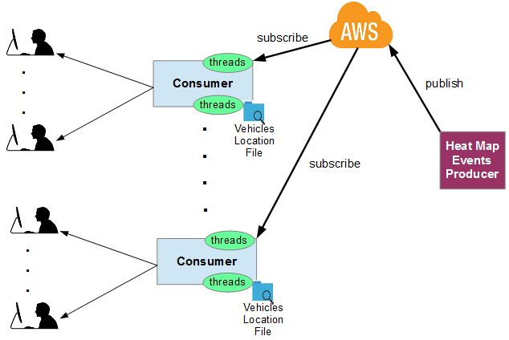

# Denis map-test AWS Consumer 2018
Test map application developed with Spring Boot and AWS SQS (Simple Queue Service) and SNS (Simple Notification Service).
 MAP_KEY environment variable must be set with the LocationIQ map token.
 
 
 
 
A small application that updates the UK map based on 2 independent continuous streams of events: 
1) around 20000 risk areas (Heat map) updated every 10 seconds (reload required to keeping tracking afterwards).
2) 100 moving vehicles updated every 2 seconds.

The risk areas are generated by the companion application "Denis map-test AWS Supplier" and transmitted asynchronously via AWS SNS and SQS services.

*Server command line:
=====================
java -jar build/libs/heatmap-aws_consumer-1.0.0.jar {lab} {vehicles} {rate} {inputFile}
 *Lab = Type of simulation. Valid Values: 1, 2, both. Default: both
 *Vehicles = Number of vehicles to track. Defaul: 10
 *Rate = Vehicles real refresh interval in seconds. Default: 60
 *inputFile = Name of the file containing the vehicles' positions. Default: ./files/realtimelocation.csv
 *example: java -jar build/libs/heatmap-aws_consumer-1.0.0.jar both 100 2 ./files/realtimelocation.csv

*Client URL:
============
localhost:8080

*Cloud URL:
===========
https://calm-sierra-95543.herokuapp.com/

